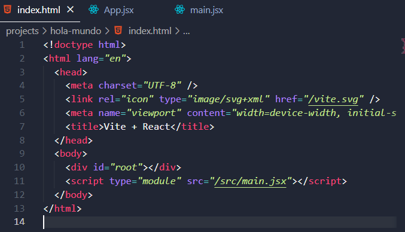
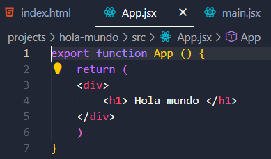
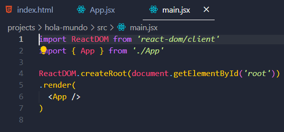
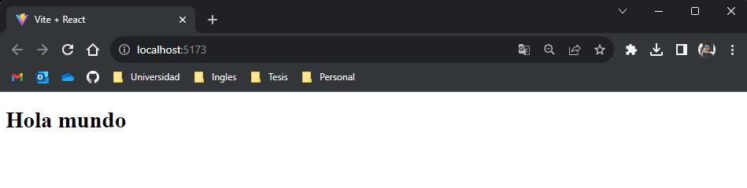

# Introducción al Desarrollo de SPA con React

Las Aplicaciones de Página Única (SPA) han transformado la forma en que se construyen y experimentan las aplicaciones web modernas. En este ensayo, exploraremos cómo React, una de las bibliotecas de JavaScript más populares, se utiliza en el desarrollo de SPAs. Las SPAs permiten a los usuarios interactuar con una aplicación web sin necesidad de recargar toda la página, lo que brinda una experiencia de usuario fluida y rápida.

## ¿Qué es una SPA?
Una Aplicación de Página Única (SPA) es un tipo de aplicación web que carga una sola página inicial y luego actualiza dinámicamente el contenido en esa página a medida que los usuarios interactúan con la aplicación. En lugar de navegar a diferentes páginas web, los usuarios pueden cambiar entre secciones y vistas dentro de la misma página, lo que crea una experiencia de usuario más similar a una aplicación de escritorio.

## React: Historia y Contexto
La historia de React se remonta a 2013 cuando Facebook lo introdujo por primera vez. Fue desarrollado para abordar los desafíos crecientes en la creación de interfaces de usuario interactivas y rápidas en aplicaciones web de gran envergadura. A lo largo de los años, React ha experimentado un rápido crecimiento y ha ganado una adopción generalizada en la comunidad de desarrollo. Lo que comenzó como una biblioteca para el desarrollo interno de Facebook se convirtió en un proyecto de código abierto ampliamente utilizado. Su popularidad se debe en gran parte a su enfoque en componentes reutilizables y a la introducción del concepto del Virtual DOM, que mejoró significativamente la eficiencia en la actualización de la interfaz de usuario. Hoy en día, React se ha convertido en una parte integral de muchas aplicaciones web y móviles de alto rendimiento, y cuenta con una comunidad activa y una amplia base de usuarios.

## Características Clave de React
- **Component-Based:** React se basa en la creación de componentes reutilizables que encapsulan la lógica y la interfaz de usuario. Esta arquitectura facilita la modularidad y el mantenimiento del código.
- **Virtual DOM:** React utiliza un Virtual DOM para optimizar las actualizaciones de la interfaz de usuario, reduciendo la manipulación directa del DOM y mejorando el rendimiento.
- **JSX:** JSX, una extensión de JavaScript permite definir la estructura de los componentes de manera declarativa, lo que mejora la legibilidad del código y la eficiencia en el desarrollo.
- **Unidirectional Data Flow:** React sigue un flujo de datos unidireccional, lo que significa que los datos fluyen en una sola dirección, lo que facilita el seguimiento de las actualizaciones y la depuración.
- **Gran Ecosistema:** React cuenta con una amplia variedad de bibliotecas y herramientas complementarias, como React Router para enrutamiento y Redux para la gestión del estado.

## Arquitectura de React
React, como biblioteca, no impone una arquitectura rígida en las aplicaciones que se construyen con ella. En su lugar, proporciona un conjunto de herramientas y conceptos que permiten a los desarrolladores tomar decisiones sobre la estructura y organización de su código. Esto significa que tienes la flexibilidad de diseñar la arquitectura de tu aplicación de acuerdo con tus necesidades específicas.

Sin embargo, React fomenta y se adapta bien a ciertos patrones y enfoques comunes en el desarrollo de aplicaciones. Uno de estos patrones populares es el patrón de "datos descendentes" o "unidireccional". En una aplicación React típica, los datos fluyen desde un componente principal hacia abajo a través de una jerarquía de componentes hijos. Esto se conoce como "flujo de datos unidireccional" y es una parte fundamental de la arquitectura de React.

## React: La Biblioteca de Elección
React es una biblioteca de JavaScript desarrollada por Facebook que se ha convertido en la opción principal para construir SPAs. Su enfoque en componentes reutilizables y su capacidad para manejar eficientemente las actualizaciones de la interfaz de usuario hacen que sea ideal para este tipo de aplicaciones. React utiliza un Virtual DOM, que es una representación en memoria de la estructura de la página, para minimizar la manipulación directa del DOM y mejorar el rendimiento en las actualizaciones.

## Beneficios de Desarrollar SPAs con React
- **Interactividad en Tiempo Real:** React permite crear interfaces de usuario altamente interactivas y receptivas. Los usuarios pueden realizar acciones como la búsqueda o la filtración de datos sin esperar a que se recargue la página.
- **Rendimiento Mejorado:** Gracias al Virtual DOM, React optimiza las actualizaciones del DOM, lo que se traduce en una mayor velocidad y una experiencia de usuario más fluida.
- **Reutilización de Componentes:** React fomenta la creación de componentes reutilizables, lo que ahorra tiempo y esfuerzo en el desarrollo y mantenimiento de la aplicación.
- **Gran Comunidad y Ecosistema:** React cuenta con una comunidad activa y una amplia gama de bibliotecas y herramientas complementarias, lo que facilita el desarrollo de SPAs personalizadas y potentes.

## Hola mundo con React

## Conclusiones
En conclusión, React es una herramienta indispensable en el desarrollo de Aplicaciones de Página Única (SPA). Su historia y evolución lo han convertido en un pilar fundamental en la comunidad de desarrollo web, gracias a su enfoque en la modularidad, el rendimiento optimizado y la creación de componentes reutilizables. La arquitectura flexible de React permite a los desarrolladores adaptarse a las necesidades específicas de sus proyectos, mientras que su ecosistema en constante crecimiento y su activa comunidad proporcionan un sólido soporte y un conjunto diverso de herramientas para construir SPAs altamente interactivas y eficientes. Al aprovechar las características clave de React, los desarrolladores pueden ofrecer a los usuarios experiencias web rápidas y fluidas, allanando el camino hacia el futuro del desarrollo de aplicaciones web modernas.
